# Hierarchical Agentic Swarm Architecture: Enterprise Integration Patterns

## Introduction: From Individual Agents to Enterprise Systems

The hierarchical bio-inspired agentic swarm trading framework represents a sophisticated approach to algorithmic trading that leverages collective intelligence and emergent behavior. However, in enterprise environments, this swarm operates as one component within a larger ecosystem of interconnected systems, data pipelines, and operational frameworks.

This article explores how hierarchical agentic swarms integrate into production-scale trading architectures, demonstrating the evolution from individual agent behaviors to enterprise-wide orchestration patterns.

## System Architecture Overview: Multi-Tier Integration

```mermaid
graph TB
    subgraph "Enterprise Trading Architecture"
        subgraph "Presentation Layer"
            WebUI[Web Trading Dashboard<br/>React/Vue.js]
            MobileApp[Mobile Trading App<br/>React Native/Flutter]
            AdminPanel[Admin Control Panel<br/>System Management]
        end
        
        subgraph "API Gateway Layer"
            APIGateway[API Gateway<br/>Kong/AWS API Gateway]
            Auth[Authentication Service<br/>OAuth 2.0/JWT]
            RateLimit[Rate Limiting<br/>Request Throttling]
        end
        
        subgraph "Application Services Layer"
            PortfolioSvc[Portfolio Management Service<br/>Java Spring Boot]
            RiskSvc[Risk Management Service<br/>Python FastAPI]
            ComplianceSvc[Compliance Service<br/>Regulatory Checks]
            NotificationSvc[Notification Service<br/>Real-time Alerts]
        end
        
        subgraph "Swarm Intelligence Layer"
            SwarmOrchestrator[Swarm Orchestrator<br/>Python AsyncIO]
            
            subgraph "Agent Hierarchy"
                QueenAgent[👑 Queen Agent<br/>Strategic Oversight]
                ScoutAgents[🔍 Scout Agents<br/>Market Discovery]
                WorkerAgents[⚡ Worker Agents<br/>Trade Execution]
                DroneAgents[🛡️ Drone Agents<br/>Risk Monitoring]
            end
            
            SwarmEnvironment[Shared Environment<br/>Pheromone Trails & State]
        end
        
        subgraph "Market Data Layer"
            IBKRWebAPI[IBKR WebAPI<br/>Options Chain Data]
            MarketDataFeed[Market Data Feed<br/>Real-time Prices]
            NewsAPI[News & Sentiment API<br/>Alpha Generation]
            EconomicData[Economic Data API<br/>Macro Indicators]
        end
        
        subgraph "Data Storage Layer"
            TimeSeriesDB[(Time Series Database<br/>InfluxDB/TimescaleDB)]
            AnalyticsDB[(Analytics Database<br/>PostgreSQL)]
            CacheLayer[(Distributed Cache<br/>Redis Cluster)]
            MessageQueue[Message Queue<br/>Apache Kafka]
        end
        
        subgraph "Infrastructure Layer"
            Kubernetes[Container Orchestration<br/>Kubernetes]
            ServiceMesh[Service Mesh<br/>Istio]
            Monitoring[Observability Stack<br/>Prometheus/Grafana]
            Secrets[Secrets Management<br/>HashiCorp Vault]
        end
    end
    
    %% User interactions
    Users[Trading Users] --> WebUI
    Users --> MobileApp
    Admins[System Administrators] --> AdminPanel
    
    %% API Gateway connections
    WebUI --> APIGateway
    MobileApp --> APIGateway
    AdminPanel --> APIGateway
    
    APIGateway --> Auth
    APIGateway --> RateLimit
    APIGateway --> PortfolioSvc
    APIGateway --> RiskSvc
    APIGateway --> ComplianceSvc
    
    %% Service layer to swarm
    PortfolioSvc --> SwarmOrchestrator
    RiskSvc --> SwarmOrchestrator
    ComplianceSvc --> SwarmOrchestrator
    
    %% Swarm internal connections
    SwarmOrchestrator --> QueenAgent
    SwarmOrchestrator --> ScoutAgents
    SwarmOrchestrator --> WorkerAgents
    SwarmOrchestrator --> DroneAgents
    
    QueenAgent --> SwarmEnvironment
    ScoutAgents --> SwarmEnvironment
    WorkerAgents --> SwarmEnvironment
    DroneAgents --> SwarmEnvironment
    
    %% Market data connections
    ScoutAgents --> IBKRWebAPI
    ScoutAgents --> MarketDataFeed
    ScoutAgents --> NewsAPI
    WorkerAgents --> IBKRWebAPI
    QueenAgent --> EconomicData
    
    %% Data storage connections
    SwarmEnvironment --> TimeSeriesDB
    SwarmEnvironment --> CacheLayer
    SwarmOrchestrator --> MessageQueue
    PortfolioSvc --> AnalyticsDB
    RiskSvc --> AnalyticsDB
    
    %% Infrastructure connections
    SwarmOrchestrator -.-> Kubernetes
    PortfolioSvc -.-> Kubernetes
    RiskSvc -.-> Kubernetes
    ComplianceSvc -.-> Kubernetes
    
    MessageQueue -.-> ServiceMesh
    TimeSeriesDB -.-> ServiceMesh
    AnalyticsDB -.-> ServiceMesh
    
    Kubernetes --> Monitoring
    ServiceMesh --> Monitoring
    Auth --> Secrets
    
    %% Styling
    classDef presentation fill:#e1f5fe
    classDef gateway fill:#f3e5f5
    classDef service fill:#e8f5e8
    classDef swarm fill:#fff3e0
    classDef agent fill:#ffeb3b
    classDef data fill:#f1f8e9
    classDef infrastructure fill:#fce4ec
    classDef external fill:#e3f2fd
    
    class WebUI,MobileApp,AdminPanel presentation
    class APIGateway,Auth,RateLimit gateway
    class PortfolioSvc,RiskSvc,ComplianceSvc,NotificationSvc service
    class SwarmOrchestrator,SwarmEnvironment swarm
    class QueenAgent,ScoutAgents,WorkerAgents,DroneAgents agent
    class TimeSeriesDB,AnalyticsDB,CacheLayer,MessageQueue data
    class Kubernetes,ServiceMesh,Monitoring,Secrets infrastructure
    class IBKRWebAPI,MarketDataFeed,NewsAPI,EconomicData external
```

## Swarm Integration Patterns: Enterprise Context

### 1. **Event-Driven Architecture Integration**

The hierarchical swarm operates within an event-driven ecosystem where market events trigger cascading responses across multiple system layers:

### 2. **Microservices Communication Patterns**

The swarm architecture embraces microservices principles, with each agent type potentially deployed as independent services:

### 3. **Data Flow Architecture**

The swarm generates and consumes multiple data streams, requiring sophisticated data pipeline integration:

## Production Deployment Architecture

### 1. **Container Orchestration with Kubernetes**

### 2. **Scalability and Performance Patterns**

## Enterprise Integration Scenarios

### 1. **Multi-Asset Class Trading Platform**

### 2. **Institutional Multi-Tenant Platform**

## Advanced Integration Patterns

### 1. **Event Sourcing and CQRS Integration**

### 2. **Machine Learning Integration Pipeline**

## Operational Excellence Patterns

### 1. **Monitoring and Observability**

### 2. **Security and Compliance Architecture**

## Implementation Roadmap: From MVP to Enterprise Scale

### Phase 1: Foundation (Months 1-2)
- **Core Swarm Framework**: Implement basic agent hierarchy
- **IBKR Integration**: Establish WebAPI connectivity
- **Basic Orchestration**: Single-asset class deployment
- **Minimal Monitoring**: Basic logging and metrics

### Phase 2: Production Readiness (Months 3-4)
- **Container Deployment**: Kubernetes infrastructure
- **Security Implementation**: Authentication and encryption
- **Performance Optimization**: Caching and connection pooling
- **Operational Monitoring**: Comprehensive observability

### Phase 3: Enterprise Features (Months 5-6)
- **Multi-Asset Support**: Cross-asset correlation and arbitrage
- **Advanced ML Integration**: Predictive models and reinforcement learning
- **Compliance Framework**: Regulatory reporting and audit trails
- **High Availability**: Multi-region deployment and disaster recovery

### Phase 4: Scale and Innovation (Months 7-12)
- **Multi-Tenant Platform**: Institutional customer onboarding
- **Advanced Analytics**: Real-time performance attribution
- **Edge Computing**: Low-latency execution nodes
- **Quantum-Ready Architecture**: Preparation for quantum algorithms

## Conclusion: The Future of Intelligent Trading Platforms

The hierarchical agentic swarm represents a paradigm shift from traditional algorithmic trading approaches. By integrating bio-inspired collective intelligence into enterprise-grade architectures, organizations can build adaptive, resilient, and highly performant trading systems that evolve with market conditions.

Key architectural principles for success:

1. **Microservices Foundation**: Enable independent scaling and deployment of agent types
2. **Event-Driven Architecture**: Support real-time responsiveness and system decoupling
3. **Cloud-Native Design**: Leverage container orchestration and modern deployment patterns
4. **Observability First**: Implement comprehensive monitoring from day one
5. **Security by Design**: Integrate security controls at every architectural layer
6. **ML-Enhanced Intelligence**: Combine human expertise with machine learning capabilities

The integration patterns demonstrated here provide a roadmap for transforming individual agent intelligence into enterprise-scale competitive advantage, positioning organizations to thrive in increasingly complex and dynamic financial markets.

Our P5002 IBKR handler, P5003 swarm framework, and P5004 integration layer provide the foundational components for building these sophisticated systems, offering individual traders and institutional platforms alike the tools needed to implement cutting-edge algorithmic trading strategies at scale.
