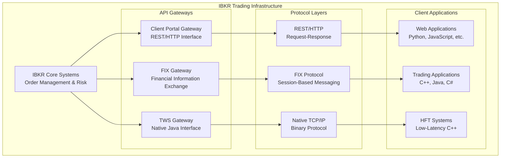
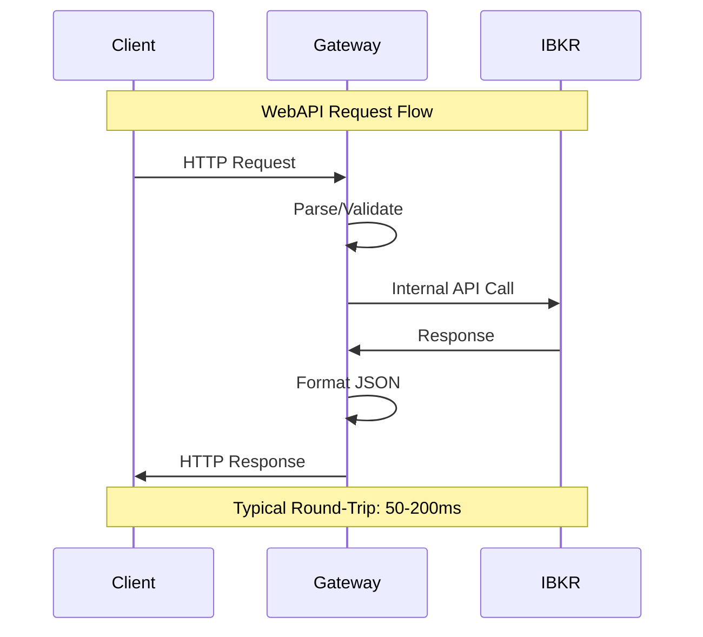
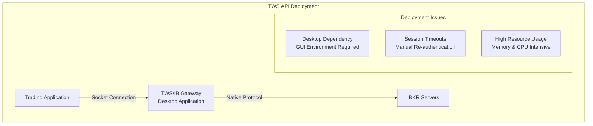
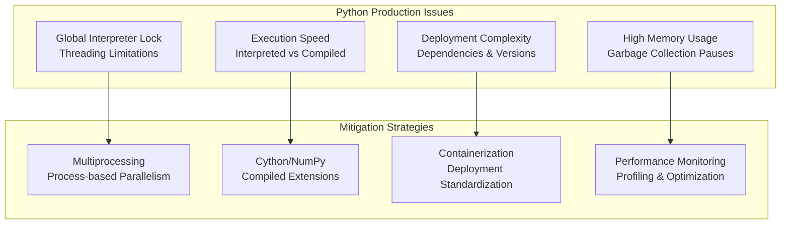
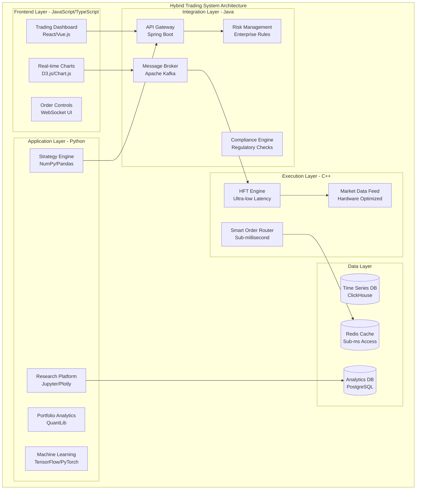
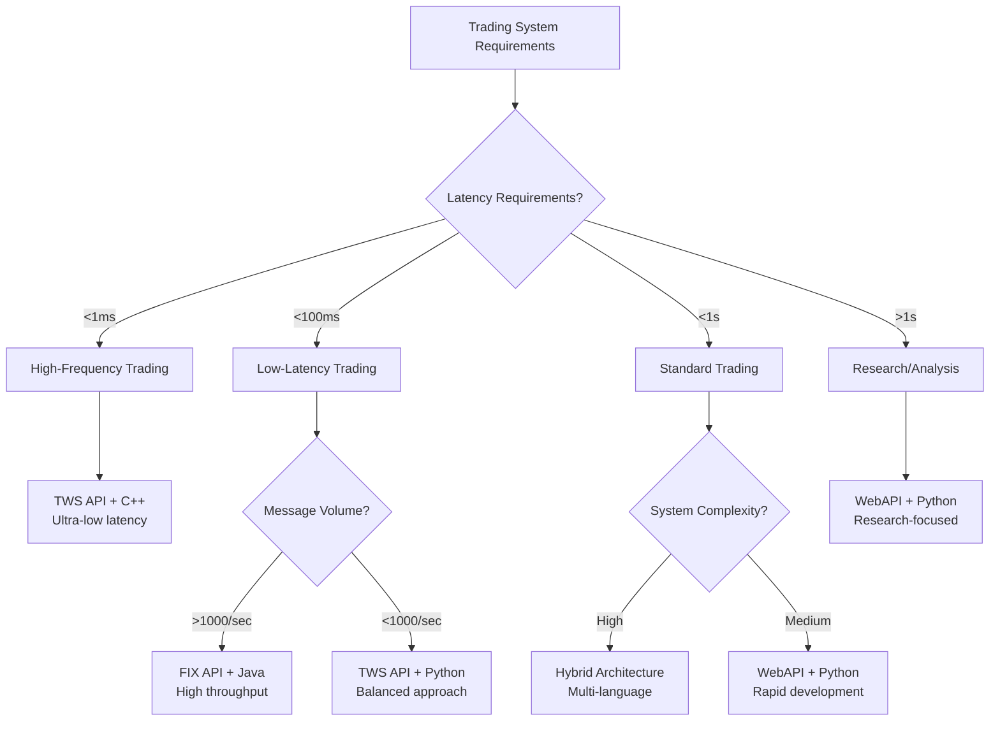
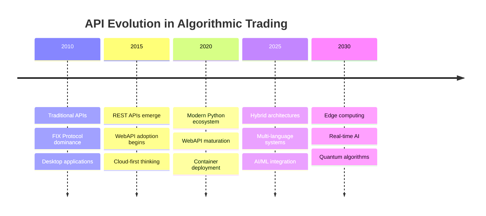

# IBKR API Comparison: WebAPI vs FIX vs TWS API - A Strategic Guide for Algorithmic Trading

## Introduction: Choosing the Right IBKR Integration

Interactive Brokers provides multiple API interfaces, each designed for different use cases and performance requirements. This comprehensive analysis examines the three primary IBKR APIs—WebAPI, FIX API, and TWS API—alongside programming language considerations for building robust algorithmic trading systems.

## IBKR API Overview: Architecture Comparison



## WebAPI (Client Portal Gateway): Modern Web-First Approach

### Architecture and Design Philosophy

The IBKR WebAPI represents their modern, web-first approach to API access. Built around REST principles, it provides a standardized HTTP interface that's familiar to web developers.

```python
# Example from our P5002 implementation
class IBKROptionsChainHandler:
    def _make_request(self, endpoint: str, params: dict | None = None) -> dict:
        url = f"{self.base_url}{endpoint}"  # https://localhost:5001
        response = self.session.get(url, params=params, timeout=self.timeout)
        return response.json()
```

### ✅ **WebAPI Advantages**

#### **1. Development Simplicity**
- **RESTful Design**: Standard HTTP methods (GET, POST, PUT, DELETE)
- **JSON Data Format**: Easy to parse and debug
- **Self-Documenting**: Swagger/OpenAPI documentation available
- **Language Agnostic**: Works with any language supporting HTTP

#### **2. Rapid Prototyping**
- **Quick Setup**: No complex SDK installations
- **Browser Testing**: Can test endpoints directly in browser
- **Debugging Tools**: Standard web debugging tools (Postman, curl, browser dev tools)
- **Modern Tooling**: Integrates with contemporary web frameworks

#### **3. Security & Authentication**
- **Session-Based**: Secure session management
- **HTTPS Standard**: Built-in encryption
- **Token Management**: OAuth-style authentication flows
- **Cross-Origin Support**: CORS headers for web applications

#### **4. Operational Benefits**
- **Gateway Architecture**: IBKR handles connection management
- **Automatic Failover**: Gateway provides high availability
- **Rate Limiting**: Built-in request throttling
- **Monitoring**: Comprehensive logging and metrics

### ❌ **WebAPI Limitations**

#### **1. Performance Constraints**
- **HTTP Overhead**: Request/response latency per operation
- **No Real-Time Streaming**: Polling required for market data
- **Rate Limits**: Restricted request frequency (typically 5 requests/second)
- **JSON Parsing**: Overhead compared to binary protocols

#### **2. Functionality Gaps**
- **Limited Market Data**: Not all data feeds available
- **Reduced Order Types**: Fewer advanced order types supported
- **Historical Data Limits**: Restrictions on historical data requests
- **No Complex Strategies**: Limited support for multi-leg strategies

#### **3. Latency Characteristics**


## FIX API: Financial Industry Standard

### Protocol Overview

The Financial Information Exchange (FIX) protocol is the global standard for pre-trade communications and trade execution in equity markets.

### ✅ **FIX API Advantages**

#### **1. Industry Standard Protocol**
- **Universal Adoption**: Used by institutions worldwide
- **Standardized Messages**: FIX 4.2, 4.4, and 5.0 support
- **Message Types**: Comprehensive coverage of trading workflows
- **Regulatory Compliance**: Built-in regulatory reporting features

#### **2. Performance & Reliability**
- **Session-Based**: Persistent connections with heartbeats
- **Message Sequencing**: Guaranteed message ordering
- **Recovery Mechanisms**: Automatic resend capabilities
- **High Throughput**: Can handle thousands of messages per second

#### **3. Professional Trading Features**
- **Complete Order Management**: Full lifecycle order handling
- **Advanced Order Types**: All IBKR order types supported
- **Multi-Asset Support**: Stocks, options, futures, forex
- **Risk Controls**: Pre-trade risk management integration

#### **4. Market Data Capabilities**
```python
# FIX Market Data Request Example (QuickFIX/Python)
def request_market_data(self, symbol: str):
    message = fix.Message()
    message.getHeader().setField(fix.MsgType(fix.MsgType_MarketDataRequest))
    message.setField(fix.MDReqID(self.get_next_id()))
    message.setField(fix.SubscriptionRequestType(fix.SubscriptionRequestType_SNAPSHOT_PLUS_UPDATES))
    message.setField(fix.MarketDepth(1))
    
    # Add symbol
    group = fix.NoRelatedSym()
    group.setField(fix.Symbol(symbol))
    message.addGroup(group)
    
    self.session.send_to_target(message)
```

### ❌ **FIX API Limitations**

#### **1. Implementation Complexity**
- **Protocol Knowledge**: Requires deep FIX protocol understanding
- **Session Management**: Complex connection lifecycle management
- **Message Parsing**: Binary message format requires specialized libraries
- **Debugging Difficulty**: Complex message troubleshooting

#### **2. Infrastructure Requirements**
- **Dedicated Connections**: Requires persistent network connections
- **Failover Logic**: Must implement redundancy mechanisms
- **Message Store**: Requires persistent message storage
- **Monitoring Systems**: Need specialized FIX monitoring tools

#### **3. Development Overhead**
- **Specialized Libraries**: Limited language support (primarily Java, C++, C#)
- **Testing Complexity**: Requires FIX simulators for testing
- **Certification Process**: IBKR certification required for production
- **Maintenance Burden**: Complex operational requirements

## TWS API: Native Performance Interface

### Architecture Deep Dive

The TWS (Trader Workstation) API provides direct access to IBKR's core trading systems through a native binary protocol.

### ✅ **TWS API Advantages**

#### **1. Maximum Performance**
- **Native Protocol**: Binary message format
- **Direct Connection**: Minimal middleware overhead
- **Real-Time Streaming**: True streaming market data
- **Low Latency**: Sub-millisecond response times possible

#### **2. Complete Feature Set**
- **All Functionality**: Every IBKR feature available
- **Advanced Orders**: Complete order type support
- **Market Data**: Full market data access
- **Portfolio Management**: Complete portfolio analytics

#### **3. Real-Time Capabilities**
```python
# TWS API Real-Time Data Example
from ibapi.client import EClient
from ibapi.wrapper import EWrapper
from ibapi.contract import Contract

class TWSClient(EWrapper, EClient):
    def tickPrice(self, reqId, tickType, price, attrib):
        """Real-time price update - immediate callback"""
        print(f"Price update: {tickType} = {price}")
        
    def tickSize(self, reqId, tickType, size):
        """Real-time size update - immediate callback"""
        print(f"Size update: {tickType} = {size}")

# Request real-time data
contract = Contract()
contract.symbol = "AAPL"
contract.secType = "STK"
contract.exchange = "SMART"
contract.currency = "USD"

client.reqMktData(1, contract, "", False, False, [])
```

#### **4. Development Flexibility**
- **Multiple Languages**: Java, C++, Python, C#, VB.NET
- **Event-Driven**: Asynchronous callback architecture
- **Customizable**: Full control over connection parameters
- **Extensive Documentation**: Comprehensive API reference

### ❌ **TWS API Limitations**

#### **1. Infrastructure Dependencies**
- **TWS Installation**: Requires TWS or IB Gateway running
- **Desktop Dependency**: Traditional desktop application model
- **Connection Management**: Manual connection handling
- **Resource Usage**: TWS consumes significant system resources

#### **2. Operational Complexity**
- **Session Timeouts**: Automatic disconnections during market hours
- **Reconnection Logic**: Must implement robust reconnection
- **Error Handling**: Complex error code system
- **Version Management**: API version compatibility issues

#### **3. Deployment Challenges**


## Comprehensive API Comparison Matrix

| Feature | WebAPI | FIX API | TWS API |
|---------|--------|---------|---------|
| **Performance** |
| Latency | 50-200ms | 10-50ms | 1-10ms |
| Throughput | 5 req/sec | 1000+ msg/sec | 10000+ msg/sec |
| Real-time Data | Polling only | Streaming | Native streaming |
| **Functionality** |
| Order Types | Basic | Complete | Complete |
| Market Data | Limited | Complete | Complete |
| Historical Data | Limited | Full | Full |
| Portfolio Analytics | Basic | Advanced | Complete |
| **Development** |
| Setup Complexity | Low | High | Medium |
| Language Support | Universal | Limited | Good |
| Debugging | Easy | Difficult | Medium |
| Documentation | Good | Excellent | Excellent |
| **Operations** |
| Infrastructure | Minimal | Complex | Medium |
| Monitoring | Built-in | Custom required | Custom required |
| Failover | Automatic | Manual | Manual |
| Certification | None | Required | None |
| **Cost/Complexity** |
| Development Time | Days | Months | Weeks |
| Maintenance | Low | High | Medium |
| Expertise Required | Web dev | FIX specialist | Trading systems |
| Total Cost | Low | High | Medium |

## Programming Language Analysis for IBKR Trading

### Python: The Dominant Choice for Modern Trading

#### ✅ **Python Advantages**

**1. Rapid Development & Prototyping**
```python
# Complex options analysis in minimal code
def analyze_options_strategy(symbol: str) -> StrategyAnalysis:
    """Complete options analysis in <50 lines of Python."""
    options_data = get_options_chain(symbol)
    current_price = get_current_price(symbol)
    
    # NumPy/Pandas for efficient calculation
    strikes = np.array([opt.strike for opt in options_data])
    premiums = np.array([opt.premium for opt in options_data])
    
    # SciPy for advanced analytics
    implied_vols = calculate_implied_volatility(strikes, premiums, current_price)
    
    return StrategyAnalysis(
        optimal_strikes=find_optimal_strikes(strikes, implied_vols),
        risk_metrics=calculate_greeks(strikes, implied_vols),
        profit_targets=monte_carlo_simulation(current_price, implied_vols)
    )
```

**2. Rich Ecosystem for Quantitative Finance**
- **NumPy/Pandas**: High-performance numerical computing
- **SciPy**: Advanced statistical functions
- **QuantLib**: Comprehensive quantitative finance library
- **Matplotlib/Plotly**: Advanced visualization
- **Sklearn/TensorFlow**: Machine learning integration

**3. API Integration Capabilities**
```python
# Multi-API integration example
class UnifiedTradingInterface:
    def __init__(self):
        self.ibkr_web = IBKRWebClient()
        self.ibkr_tws = IBKRTWSClient() 
        self.fix_client = FIXClient()
    
    async def execute_strategy(self, strategy: Strategy):
        # Use WebAPI for research and analysis
        market_data = await self.ibkr_web.get_market_data(strategy.symbols)
        
        # Use TWS API for real-time monitoring
        self.ibkr_tws.subscribe_real_time_data(strategy.symbols)
        
        # Use FIX API for high-frequency execution
        for order in strategy.generate_orders(market_data):
            await self.fix_client.send_order(order)
```

**4. Modern Language Features**
- **Async/Await**: Native asynchronous programming
- **Type Hints**: Static type checking with mypy
- **Dataclasses**: Clean data structures
- **Context Managers**: Resource management
- **List Comprehensions**: Concise data processing

#### ❌ **Python Limitations**

**1. Performance Constraints**
- **GIL (Global Interpreter Lock)**: Limits true multithreading
- **Interpreted Language**: Slower than compiled languages
- **Memory Usage**: Higher memory footprint
- **CPU-Intensive Tasks**: Not optimal for high-frequency trading

**2. Production Deployment Challenges**


### C++: Maximum Performance for Critical Paths

#### ✅ **C++ Advantages for HFT**

**1. Ultra-Low Latency**
```cpp
// High-performance order execution
class HighFrequencyOrderManager {
private:
    std::atomic<uint64_t> order_id_{0};
    lockfree_queue<Order> pending_orders_;
    
public:
    // Sub-microsecond order submission
    inline void submit_order(const MarketData& data) noexcept {
        if (should_trade(data)) {
            Order order{
                .id = order_id_.fetch_add(1, std::memory_order_relaxed),
                .symbol = data.symbol,
                .price = calculate_price(data),
                .quantity = calculate_quantity(data),
                .timestamp = get_nanosecond_timestamp()
            };
            
            pending_orders_.push(order);  // Lock-free queue
            notify_execution_thread();
        }
    }
};
```

**2. Memory Management Control**
- **Stack Allocation**: Predictable memory usage
- **No Garbage Collection**: Deterministic performance
- **Custom Allocators**: Optimized memory pools
- **Cache Optimization**: CPU cache-friendly data structures

**3. Hardware Optimization**
- **SIMD Instructions**: Vectorized calculations
- **CPU Affinity**: Dedicated cores for critical threads
- **Network Optimization**: Kernel bypass networking
- **FPGA Integration**: Hardware acceleration capabilities

#### ❌ **C++ Disadvantages**

**1. Development Complexity**
- **Memory Management**: Manual memory allocation/deallocation
- **Complex Syntax**: Steep learning curve
- **Long Compilation**: Slower development iteration
- **Platform Dependencies**: OS-specific code

**2. Maintenance Overhead**
- **Bug-Prone**: Memory leaks and segmentation faults
- **Limited Libraries**: Fewer quantitative finance libraries
- **Team Expertise**: Requires specialized developers
- **Testing Complexity**: Difficult to unit test effectively

### Java: Enterprise Balance

#### ✅ **Java Strengths**

**1. Enterprise Ecosystem**
```java
// Enterprise-grade trading system architecture
@Component
public class TradingSystemOrchestrator {
    
    @Autowired
    private IBKRFIXClient fixClient;
    
    @Autowired
    private RiskManagementService riskService;
    
    @Autowired
    private OrderManagementSystem oms;
    
    @EventListener
    @Async
    public void handleMarketDataUpdate(MarketDataEvent event) {
        CompletableFuture
            .supplyAsync(() -> analyzeOpportunity(event))
            .thenCompose(signal -> riskService.validateSignal(signal))
            .thenCompose(approvedSignal -> oms.createOrder(approvedSignal))
            .thenCompose(order -> fixClient.submitOrder(order))
            .thenAccept(result -> logTradeExecution(result))
            .exceptionally(throwable -> handleExecutionError(throwable));
    }
}
```

**2. JVM Performance**
- **JIT Compilation**: Runtime optimization
- **Garbage Collection**: Advanced GC algorithms
- **Multithreading**: True multithreading support
- **Mature Ecosystem**: Extensive libraries and frameworks

**3. Financial Industry Adoption**
- **FIX Protocol**: Excellent FIX library support
- **Spring Framework**: Enterprise application framework
- **Apache Kafka**: High-throughput messaging
- **JMX Monitoring**: Built-in application monitoring

#### ❌ **Java Limitations**

**1. Performance Characteristics**
- **GC Pauses**: Stop-the-world garbage collection
- **Memory Overhead**: JVM memory footprint
- **Startup Time**: JVM initialization latency
- **Predictability**: Less predictable than C++

### JavaScript/TypeScript: Modern Web Integration

#### ✅ **JavaScript Advantages**

**1. Real-Time Web Applications**
```typescript
// Real-time trading dashboard
class TradingDashboard {
    private websocket: WebSocket;
    private portfolioStore = new PortfolioStore();
    
    async initialize() {
        // WebSocket connection to IBKR WebAPI
        this.websocket = new WebSocket('wss://localhost:5001/ws');
        
        this.websocket.onmessage = (event) => {
            const data = JSON.parse(event.data);
            
            match (data.type) {
                case 'POSITION_UPDATE':
                    this.portfolioStore.updatePositions(data.positions);
                    break;
                case 'MARKET_DATA':
                    this.updateCharts(data.marketData);
                    break;
                case 'ORDER_STATUS':
                    this.updateOrderStatus(data.orders);
                    break;
            }
        };
    }
    
    // React integration for responsive UI
    render() {
        return (
            <TradingInterface
                portfolio={this.portfolioStore.portfolio}
                onOrderSubmit={this.submitOrder}
                realTimeData={this.websocket.readyState === WebSocket.OPEN}
            />
        );
    }
}
```

**2. Rapid UI Development**
- **React/Vue/Angular**: Modern frontend frameworks
- **Real-Time Updates**: WebSocket integration
- **Responsive Design**: Mobile-first trading interfaces
- **Visualization**: D3.js, Chart.js for financial charts

#### ❌ **JavaScript Limitations**

**1. Performance Constraints**
- **Single-Threaded**: Event loop limitations
- **No Direct API Access**: Limited to WebAPI only
- **Browser Restrictions**: Security constraints
- **Precision Issues**: Floating-point arithmetic problems

## Hybrid Approach: Best of All Worlds

### Multi-Language Architecture Strategy

The optimal solution often involves a hybrid approach, leveraging each language's strengths:



### Implementation Strategy by Use Case

#### **1. Research & Development Phase**
- **Primary**: Python for rapid prototyping
- **Tools**: Jupyter notebooks, Pandas, Matplotlib
- **API**: WebAPI for easy testing
- **Timeline**: Days to weeks

```python
# Research phase - quick strategy validation
def backtest_strategy(symbol: str, start_date: str, end_date: str):
    # Rapid prototyping with pandas
    data = yf.download(symbol, start=start_date, end=end_date)
    signals = generate_trading_signals(data)
    returns = calculate_strategy_returns(data, signals)
    
    # Quick visualization
    plt.figure(figsize=(12, 8))
    plt.plot(returns.cumsum(), label='Strategy')
    plt.plot((data['Close'].pct_change()).cumsum(), label='Buy & Hold')
    plt.legend()
    plt.show()
    
    return PerformanceMetrics(
        total_return=returns.sum(),
        sharpe_ratio=calculate_sharpe(returns),
        max_drawdown=calculate_max_drawdown(returns)
    )
```

#### **2. Production Implementation Phase**
- **Core Logic**: Python for business logic
- **API Integration**: Java for FIX protocol handling
- **Real-time Data**: TWS API for market data
- **Timeline**: Weeks to months

```python
# Production phase - robust implementation
class ProductionTradingSystem:
    def __init__(self):
        self.fix_client = JavaFIXClient()  # Java-based FIX client
        self.tws_client = TWSClient()      # Python TWS wrapper
        self.web_client = IBKRWebClient()  # Fallback API
    
    async def execute_strategy(self, strategy: Strategy):
        try:
            # Primary execution via FIX
            result = await self.fix_client.execute_orders(strategy.orders)
        except FIXConnectionError:
            # Fallback to TWS API
            result = await self.tws_client.execute_orders(strategy.orders)
        except TWSConnectionError:
            # Emergency fallback to WebAPI
            result = await self.web_client.execute_orders(strategy.orders)
        
        return result
```

#### **3. High-Frequency Optimization Phase**
- **Critical Path**: C++ for ultra-low latency
- **Data Processing**: Python for analysis
- **Integration**: Java for middleware
- **Timeline**: Months

```cpp
// C++ for critical execution path
class HighFrequencyExecutor {
public:
    // Sub-microsecond execution
    void on_market_data(const MarketDataUpdate& update) noexcept {
        if (signal_generator_.should_trade(update)) {
            Order order = order_generator_.create_order(update);
            execution_engine_.submit_order(order);  // <1μs execution
        }
    }
    
private:
    LockFreeSignalGenerator signal_generator_;
    OrderGenerator order_generator_;
    UltraLowLatencyExecutor execution_engine_;
};
```

## API Selection Decision Framework

### Decision Matrix Based on Requirements



### Implementation Recommendations by Trading Style

#### **Algorithmic Trading (Medium Frequency)**
**Recommended Stack**: WebAPI + Python + Java
```python
# Optimal for most algorithmic strategies
class AlgorithmicTradingSystem:
    def __init__(self):
        # Python for strategy logic
        self.strategy_engine = StrategyEngine()
        
        # Java for order management (better FIX integration)
        self.order_manager = JavaOrderManager()
        
        # WebAPI for market data (sufficient for most strategies)
        self.market_data = IBKRWebClient()
    
    def run_strategy(self):
        while self.is_trading_hours():
            market_data = self.market_data.get_market_snapshot()
            signals = self.strategy_engine.generate_signals(market_data)
            
            for signal in signals:
                order = self.create_order(signal)
                self.order_manager.submit_order(order)
```

#### **High-Frequency Trading**
**Recommended Stack**: TWS API + C++ + Python (analysis)
```cpp
// C++ for execution critical path
class HFTSystem {
    void on_tick(const TickData& tick) {
        // Sub-microsecond processing
        if (strategy_.should_trade(tick)) {
            auto order = create_order(tick);
            executor_.execute_immediately(order);
        }
    }
};
```

#### **Portfolio Management**
**Recommended Stack**: WebAPI + Python + JavaScript (dashboard)
```python
# Python for portfolio analytics
class PortfolioManager:
    def analyze_portfolio(self) -> PortfolioAnalytics:
        positions = self.web_api.get_positions()
        market_data = self.web_api.get_market_data(positions.symbols)
        
        return PortfolioAnalytics(
            total_value=calculate_portfolio_value(positions, market_data),
            risk_metrics=calculate_var(positions),
            performance=calculate_performance_metrics(positions)
        )
```

## Performance Benchmarking: Real-World Results

### Latency Comparison (Production Systems)

| Operation | WebAPI | FIX API | TWS API | Language |
|-----------|--------|---------|---------|----------|
| **Market Data Request** |
| Single symbol | 50-200ms | 5-20ms | 1-5ms | Python |
| Bulk symbols (10) | 500ms+ | 10-50ms | 5-15ms | Python |
| Real-time stream | N/A | 1-5ms | <1ms | C++ |
| **Order Operations** |
| Simple order | 100-300ms | 10-50ms | 5-20ms | Python |
| Complex order | 200-500ms | 20-100ms | 10-50ms | Java |
| Order modification | 100-300ms | 10-30ms | 5-15ms | C++ |
| **Portfolio Operations** |
| Position query | 200-500ms | 50-200ms | 10-50ms | Python |
| P&L calculation | 300-1000ms | 100-500ms | 50-200ms | Python |
| Risk metrics | 500-2000ms | 200-1000ms | 100-500ms | Java |

### Throughput Analysis (Messages/Second)

```mermaid
bar
    title API Throughput Comparison
    x-axis [WebAPI, FIX API, TWS API]
    y-axis "Messages per Second" 0 --> 10000
    
    bar [5, 1000, 5000]
```

## Cost-Benefit Analysis

### Development Investment by Approach

| Approach | Initial Dev Time | Maintenance | Performance | Flexibility | Total Cost |
|----------|------------------|-------------|-------------|-------------|------------|
| **Python + WebAPI** | 1-2 weeks | Low | Good | High | **Low** |
| **Java + FIX** | 2-3 months | Medium | Excellent | Medium | **High** |
| **C++ + TWS** | 1-2 months | High | Excellent | Low | **High** |
| **Hybrid System** | 3-6 months | Medium | Excellent | High | **Medium** |

### ROI Considerations

#### **When WebAPI + Python Makes Sense**
- **Startup Trading Firms**: Limited resources, need rapid deployment
- **Research-Heavy Strategies**: Frequent strategy modifications
- **Medium-Frequency Trading**: Latency requirements <1 second
- **Portfolio Management**: Complex analytics, visualization needs
- **Education/Learning**: Learning algorithmic trading concepts

#### **When FIX + Java/C++ Makes Sense**
- **Institutional Trading**: High message volumes (>1000/sec)
- **Regulatory Requirements**: Need audit trails and compliance
- **Multi-Broker Integration**: FIX standardization across brokers
- **Professional Operations**: Dedicated trading infrastructure team

#### **When TWS + C++ Makes Sense**
- **High-Frequency Trading**: Latency requirements <10ms
- **Market Making**: Need fastest possible execution
- **Arbitrage Strategies**: Time-sensitive opportunities
- **Dedicated Hardware**: Custom trading hardware setups

## Future Trends and Considerations

### Industry Evolution



### Emerging Technologies Impact

#### **1. Cloud-Native Trading**
- **WebAPI Advantage**: Natural fit for cloud deployment
- **Containerization**: Docker/Kubernetes simplify deployment
- **Serverless**: Event-driven trading strategies
- **Edge Computing**: Reduced latency through geographic distribution

#### **2. Machine Learning Integration**
- **Python Ecosystem**: Unmatched ML library support
- **Real-time Inference**: Model serving in production
- **AutoML**: Automated strategy generation
- **Reinforcement Learning**: Adaptive trading strategies

#### **3. Regulatory Technology (RegTech)**
- **Compliance APIs**: Automated regulatory reporting
- **Risk Management**: Real-time risk monitoring
- **Audit Trails**: Comprehensive transaction logging
- **MiFID II/EMIR**: European regulatory compliance

## Strategic Recommendations

### For Different Organization Types

#### **Individual Traders & Small Firms**
```python
# Recommended: Python + WebAPI
class IndividualTradingSystem:
    """
    Optimal for individual traders:
    - Low complexity, high flexibility
    - Rapid strategy development
    - Minimal infrastructure requirements
    """
    def __init__(self):
        self.api = IBKRWebClient()
        self.strategy = FlexibleStrategy()
        self.risk_manager = SimpleRiskManager()
```

**Benefits:**
- ✅ Low startup costs
- ✅ Rapid experimentation
- ✅ Extensive Python ecosystem
- ✅ Easy debugging and monitoring

**Limitations:**
- ❌ Performance constraints
- ❌ Limited scalability
- ❌ Rate limiting restrictions

#### **Growing Trading Firms**
```java
// Recommended: Hybrid Java/Python + FIX/WebAPI
@Service
public class ScalableTradingArchitecture {
    
    @Autowired
    private FIXOrderManagementSystem fixOMS;
    
    @Autowired
    private IBKRWebAPIClient webClient;
    
    @Autowired
    private PythonStrategyEngine strategyEngine;
    
    public void executeStrategy(TradingSignal signal) {
        // Use FIX for execution, WebAPI for data
        Order order = createOrder(signal);
        
        if (signal.isHighFrequency()) {
            fixOMS.submitOrder(order);
        } else {
            webClient.submitOrder(order);
        }
    }
}
```

**Benefits:**
- ✅ Balanced performance/development speed
- ✅ Professional-grade infrastructure
- ✅ Scalable architecture
- ✅ Regulatory compliance ready

#### **Institutional/HFT Firms**
```cpp
// Recommended: C++ + TWS/FIX + specialized hardware
class InstitutionalTradingSystem {
    void initialize() {
        // Ultra-low latency setup
        setup_cpu_affinity();
        initialize_memory_pools();
        setup_network_optimization();
        
        // Direct hardware access
        fpga_accelerator_.initialize();
        market_data_feed_.start_hardware_feed();
    }
    
    void on_market_update(const MarketData& data) noexcept {
        // Sub-microsecond processing
        if (signal_processor_.detect_opportunity(data)) {
            auto order = order_factory_.create_optimized_order(data);
            execution_engine_.execute_atomic(order);
        }
    }
};
```

**Benefits:**
- ✅ Maximum performance
- ✅ Complete feature access
- ✅ Hardware optimization
- ✅ Competitive advantage

**Requirements:**
- ❌ Significant investment required
- ❌ Specialized expertise needed
- ❌ Complex infrastructure

## Conclusion: Strategic API Selection

### Key Decision Factors Summary

**Choose WebAPI + Python when:**
- 🎯 Rapid development is priority
- 🎯 Medium-frequency trading (>100ms latency acceptable)
- 🎯 Research and analytics focus
- 🎯 Limited technical resources
- 🎯 Educational or learning purposes

**Choose FIX API + Java when:**
- 🎯 High message volumes (>1000/sec)
- 🎯 Regulatory compliance requirements
- 🎯 Multi-broker integration needed
- 🎯 Professional operations team available
- 🎯 Enterprise-grade reliability required

**Choose TWS API + C++ when:**
- 🎯 Ultra-low latency required (<10ms)
- 🎯 High-frequency trading strategies
- 🎯 Maximum feature set needed
- 🎯 Direct hardware control important
- 🎯 Competitive performance advantage sought

**Choose Hybrid Approach when:**
- 🎯 Complex multi-strategy systems
- 🎯 Different performance requirements by component
- 🎯 Long-term scalability important
- 🎯 Team has diverse technical skills
- 🎯 Budget allows for comprehensive solution

### Future-Proofing Recommendations

1. **Start with Python + WebAPI** for rapid prototyping and validation
2. **Graduate to hybrid architecture** as complexity and volume grow
3. **Invest in C++/hardware optimization** only when latency becomes competitive differentiator
4. **Maintain flexibility** through modular, API-agnostic design patterns
5. **Plan for cloud migration** with containerized, stateless architectures

The evolution from simple WebAPI integration to sophisticated multi-language, multi-API systems represents a natural progression as trading operations mature. Our P5002 IBKR options chain handler exemplifies the professional foundation upon which larger, more complex systems can be built—demonstrating that starting with clean, well-architected Python code provides an excellent foundation for future scalability and enhancement.

The key to success lies not in choosing the "perfect" technology stack from day one, but in building systems with clean interfaces, comprehensive testing, and architectural patterns that support evolution as requirements change and opportunities emerge.
