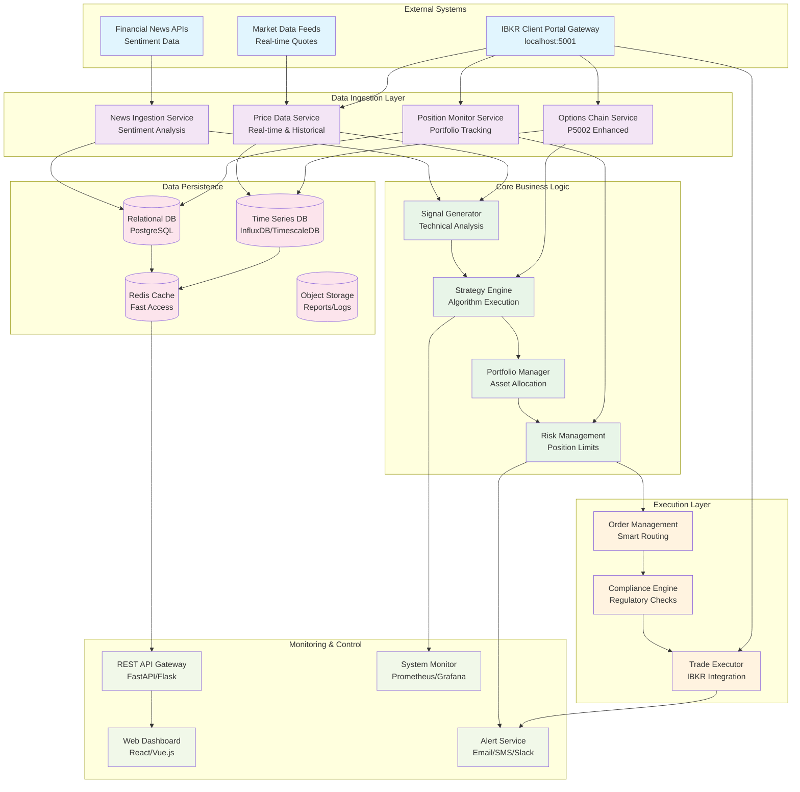
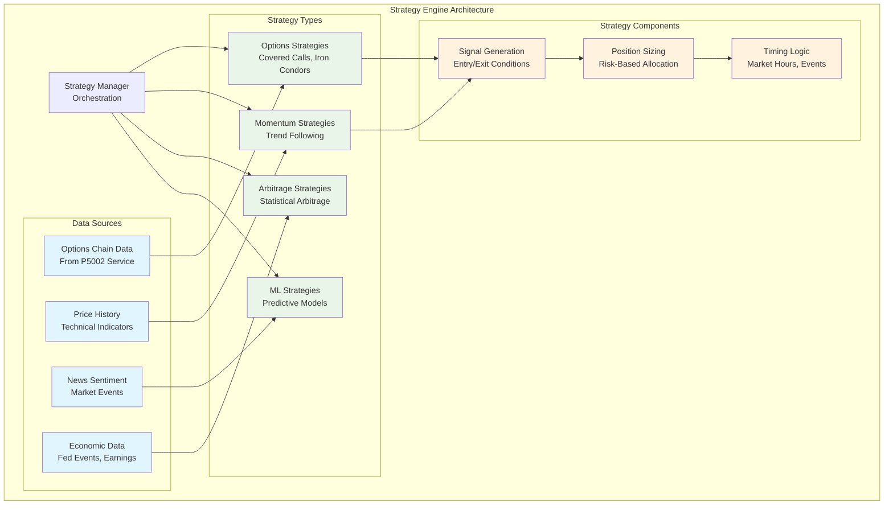
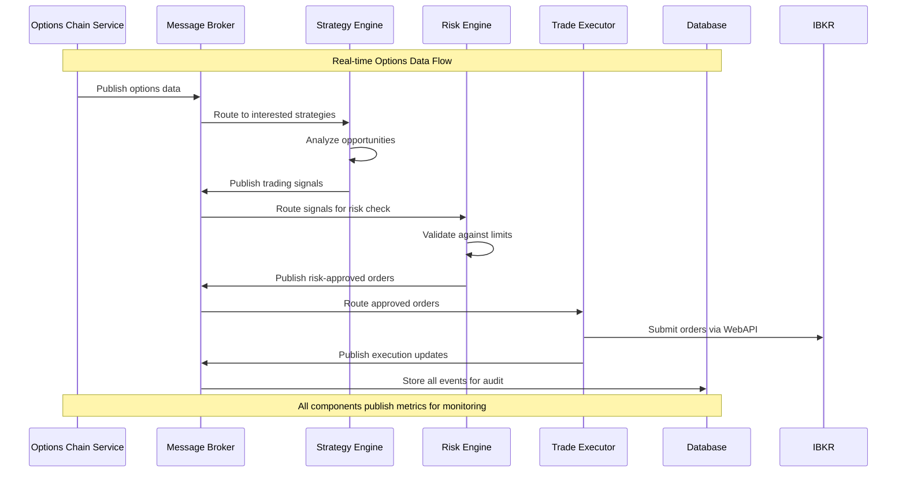
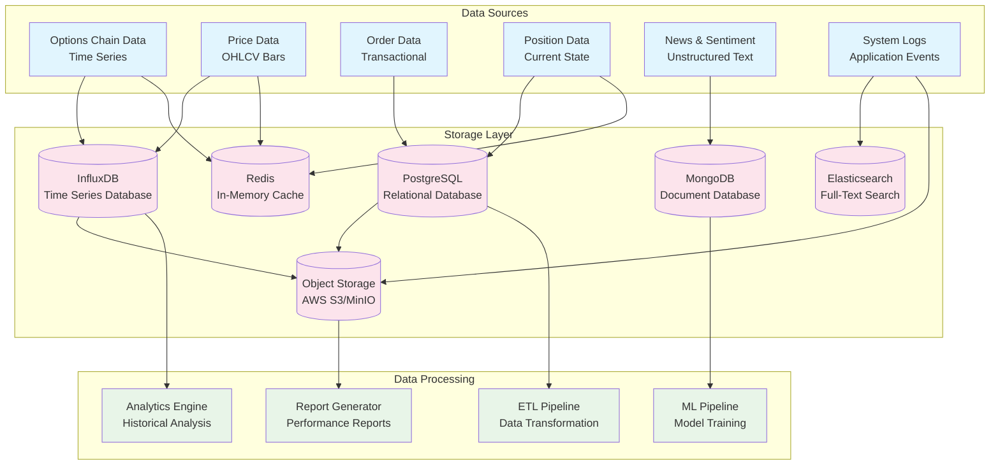
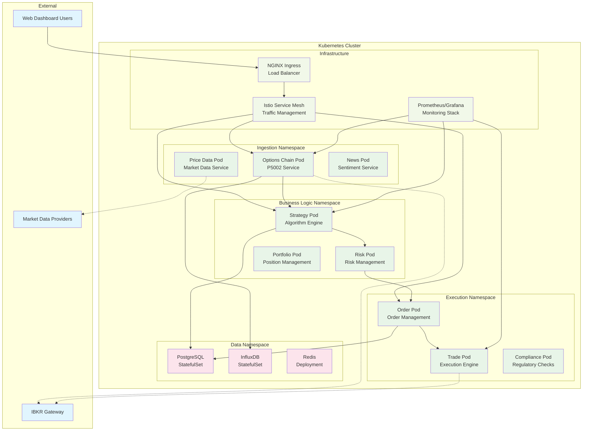
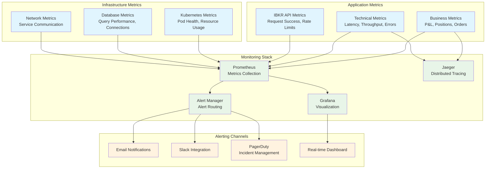
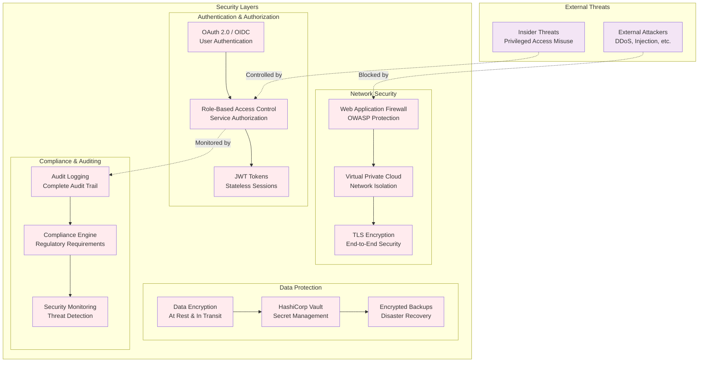

# Enterprise IBKR Trading System Architecture: A Microservices Approach

## Introduction: Beyond Single-Purpose Scripts

While individual IBKR WebAPI programs like our options chain handler demonstrate professional coding practices, real-world algorithmic trading demands a comprehensive system architecture. This article explores how our P5002 options chain handler integrates into a larger ecosystem of interconnected services, each leveraging different aspects of the IBKR WebAPI to create a robust, scalable trading platform.

## System Overview: Microservices Architecture

Modern trading systems employ microservices architecture to achieve scalability, maintainability, and fault tolerance. Each service focuses on a specific domain while communicating through well-defined APIs.



## Component Deep Dive: Service Responsibilities

### 1. Data Ingestion Layer

#### **Options Chain Service (P5002 Enhanced)**
Our enhanced options chain handler serves as a specialized data ingestion service:

**Key Responsibilities:**
- Real-time options chain data retrieval
- Strike filtering and optimization
- Performance monitoring and alerting
- Data validation and quality assurance

**Integration Points:**
```python
# Service integration example
class OptionsChainService:
    def __init__(self, config: IBKRConfig, message_broker: MessageBroker):
        self.handler = IBKROptionsChainHandler.from_config(config)
        self.broker = message_broker
    
    async def publish_options_data(self, symbol: str):
        """Publish options data to message queue for downstream consumption."""
        contracts = await self.handler.get_contract_details_batch(...)
        await self.broker.publish('options.data', {
            'symbol': symbol,
            'timestamp': datetime.now(),
            'contracts': [contract.to_dict() for contract in contracts]
        })
```

#### **Price Data Service**
Handles real-time and historical price data:

```python
class PriceDataService:
    """Real-time price data ingestion with IBKR WebAPI."""
    
    async def stream_market_data(self, symbols: list[str]):
        """Stream real-time market data using IBKR WebSocket API."""
        for symbol in symbols:
            price_data = await self.ibkr_client.get_market_data_stream(symbol)
            await self.publish_price_update(symbol, price_data)
    
    async def get_historical_data(self, symbol: str, period: str):
        """Fetch historical data for backtesting and analysis."""
        return await self.ibkr_client.get_historical_bars(symbol, period)
```

#### **Position Monitor Service**
Tracks portfolio positions and P&L:

```python
class PositionMonitorService:
    """Monitor portfolio positions and performance."""
    
    async def get_current_positions(self):
        """Retrieve current portfolio positions from IBKR."""
        return await self.ibkr_client.get_portfolio_positions()
    
    async def calculate_portfolio_metrics(self):
        """Calculate real-time portfolio metrics."""
        positions = await self.get_current_positions()
        return {
            'total_value': sum(pos.market_value for pos in positions),
            'unrealized_pnl': sum(pos.unrealized_pnl for pos in positions),
            'day_pnl': sum(pos.day_pnl for pos in positions)
        }
```

### 2. Core Business Logic Layer

#### **Strategy Engine**
Orchestrates trading strategies using multiple data sources:



#### **Risk Management Engine**
Implements comprehensive risk controls:

```python
class RiskManagementEngine:
    """Enterprise-grade risk management system."""
    
    def __init__(self, config: RiskConfig):
        self.position_limits = config.position_limits
        self.var_calculator = VaRCalculator()
        self.stress_tester = StressTester()
    
    async def validate_order(self, order: Order) -> RiskDecision:
        """Comprehensive order validation."""
        checks = await asyncio.gather(
            self.check_position_limits(order),
            self.check_concentration_risk(order),
            self.check_var_limits(order),
            self.check_drawdown_limits(order)
        )
        
        return RiskDecision(
            approved=all(check.passed for check in checks),
            reasons=[check.reason for check in checks if not check.passed]
        )
    
    async def calculate_portfolio_var(self, confidence: float = 0.95):
        """Calculate Value at Risk for portfolio."""
        positions = await self.get_current_positions()
        return await self.var_calculator.calculate_var(positions, confidence)
```

### 3. Message-Driven Architecture

The system uses message queues for asynchronous communication:



## Data Architecture: Multi-Modal Storage

Different data types require specialized storage solutions:



## Deployment Architecture: Container Orchestration

The system deploys using Kubernetes for scalability and reliability:



## Service Communication Patterns

### 1. Synchronous Communication (REST APIs)

Critical real-time operations use REST APIs for immediate responses:

```python
# Strategy Engine calling Options Service
async def get_options_analysis(self, symbol: str) -> OptionsAnalysis:
    """Get real-time options analysis for strategy decisions."""
    async with httpx.AsyncClient() as client:
        response = await client.get(
            f"http://options-service:8000/api/v1/analysis/{symbol}",
            timeout=30.0
        )
        return OptionsAnalysis.from_dict(response.json())
```

### 2. Asynchronous Communication (Message Queues)

Non-critical updates and bulk operations use message queues:

```python
# Publishing options data updates
async def publish_options_update(self, symbol: str, data: OptionsData):
    """Publish options data to interested subscribers."""
    message = {
        'event': 'options.updated',
        'symbol': symbol,
        'timestamp': datetime.utcnow().isoformat(),
        'data': data.to_dict()
    }
    await self.message_broker.publish('options.events', message)
```

### 3. Event Streaming (Apache Kafka)

High-throughput data streaming for real-time processing:

```python
# Streaming price updates
class PriceStreamProcessor:
    async def process_price_stream(self):
        """Process high-frequency price updates."""
        async for message in self.kafka_consumer.stream('price.updates'):
            price_data = PriceUpdate.from_json(message.value)
            
            # Parallel processing for multiple strategies
            await asyncio.gather(
                self.update_options_greeks(price_data),
                self.trigger_momentum_signals(price_data),
                self.update_portfolio_valuation(price_data)
            )
```

## Configuration Management

Environment-specific configuration using modern Python patterns:

```python
@dataclass
class SystemConfig:
    """Comprehensive system configuration."""
    
    # IBKR Configuration (from P5002 enhanced)
    ibkr: IBKRConfig
    
    # Service Configuration
    services: Dict[str, ServiceConfig]
    
    # Database Configuration
    databases: Dict[str, DatabaseConfig]
    
    # Message Queue Configuration
    messaging: MessagingConfig
    
    # Risk Management Configuration
    risk: RiskConfig
    
    @classmethod
    def from_environment(cls, env: str = "production") -> 'SystemConfig':
        """Load configuration from environment."""
        config_file = f"config/{env}.yaml"
        with open(config_file) as f:
            data = yaml.safe_load(f)
        return cls(**data)
```

## Monitoring and Observability

Comprehensive monitoring across all system components:



## Security Architecture

Multi-layered security approach for financial systems:



## Development and Testing Strategy

Comprehensive testing approach for financial systems:

```python
# Integration testing with our P5002 service
@pytest.mark.asyncio
async def test_options_strategy_integration():
    """Test complete options strategy workflow."""
    
    # Setup test environment
    config = IBKRConfig(
        base_url="http://mock-ibkr:8000",  # Mock IBKR service
        symbol="AAPL",
        exchange="NASDAQ",
        price_range=10.0
    )
    
    # Initialize services
    options_service = OptionsChainService(config)
    strategy_engine = StrategyEngine()
    risk_engine = RiskEngine()
    
    # Test workflow
    options_data = await options_service.get_options_chain("AAPL")
    assert len(options_data.contracts) > 0
    
    signals = await strategy_engine.generate_signals(options_data)
    assert len(signals) > 0
    
    approved_signals = await risk_engine.validate_signals(signals)
    assert all(signal.risk_approved for signal in approved_signals)

# Performance testing
@pytest.mark.performance
async def test_system_throughput():
    """Test system can handle required throughput."""
    
    start_time = time.time()
    
    # Simulate concurrent processing
    tasks = [
        process_options_chain(symbol) 
        for symbol in ["AAPL", "MSFT", "GOOGL", "AMZN", "TSLA"]
    ]
    
    results = await asyncio.gather(*tasks)
    
    elapsed_time = time.time() - start_time
    throughput = len(results) / elapsed_time
    
    # Require minimum throughput for production
    assert throughput >= 10.0  # 10 symbols per second minimum
```

## Conclusion: Scalable Financial Architecture

This comprehensive architecture demonstrates how our enhanced P5002 options chain handler integrates into a production-ready algorithmic trading system. Key architectural benefits include:

### **Scalability**
- Microservices architecture enables horizontal scaling
- Container orchestration handles varying workloads
- Message-driven design prevents bottlenecks

### **Reliability**
- Circuit breakers prevent cascade failures
- Comprehensive monitoring detects issues early
- Automated recovery mechanisms minimize downtime

### **Maintainability**
- Clear service boundaries enable independent development
- Standardized APIs facilitate integration
- Comprehensive testing ensures system stability

### **Compliance**
- Comprehensive audit trails for regulatory requirements
- Risk management controls prevent excessive exposure
- Security layers protect sensitive financial data

### **Performance**
- In-memory caching for low-latency operations
- Optimized data structures for high-frequency processing
- Parallel processing for improved throughput

This architecture transforms individual components like our options chain handler from standalone scripts into enterprise-grade system components, ready for the demands of professional algorithmic trading operations.

The modular design ensures that as trading strategies evolve and market conditions change, the system can adapt while maintaining the reliability and performance required for financial markets. Each component, from our enhanced P5002 service to the broader risk management and execution systems, contributes to a robust, scalable, and maintainable trading platform.
